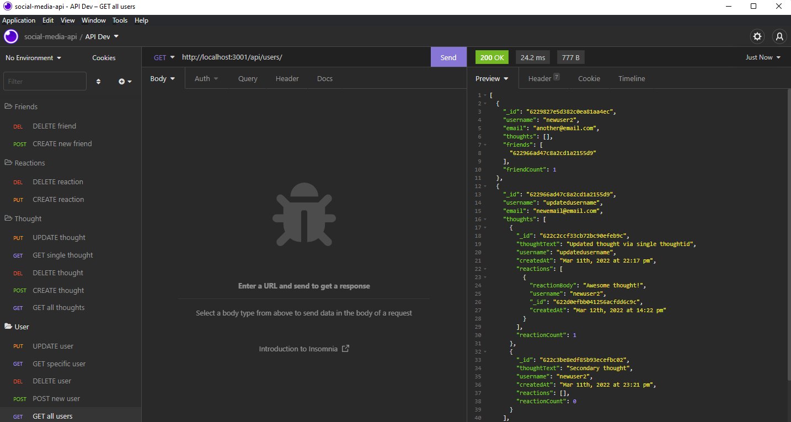

# Social Media API 

### Description 
This repository was created to provide an example social media api that that uses the following tech: 

  * `MongoDB`
  * `Mongoose` (Object-Document Mapper)
  * `Express`
  * `Node`

The DB uses two main schemas: User & Thought. Here the thougth model can be thought of as a reply. Additionally, a schema only structure called 'Reactions' was used to capture any reactions to thoughts. 

In terms of friends, the User model uses self referencing to achieve friends list functionality. That is, a different user's userID can be appended into an existing user's info to show a friend status. 

Lastly, Mongoose virtuals were used to return a count for friends, thoughts, and reactions. 

### Usage
The API is intended to be attached to a user's desired front-end. However, testing can be done by running the server using `npm start` once all required dependencies within package.json have been installed. Once running, the following api endpoints can be used.

### User Model

---

**GET** 

All users: `http://localhost:3001/api/users/`

Specific user: `http://localhost:3001/api/users/<userId>`

**POST**

Create user: `http://localhost:3001/api/users/`
With a JSON body

    Example:
      {
        "username": "<enter username>",
        "email": "<enter user email>"
      }

Add Friends: `http://localhost:3001/api/users/<userId>/friends/<friendId>`

**PUT**
Update user: `http://localhost:3001/api/users/<userId>`

    Example:
      {
        "username": "<enter username>",
        "email": "<enter user email>"
      }

**DELETE**

Delete user: `http://localhost:3001/api/users/<userId>`

Remove friend: `http://localhost:3001/api/users/<userId>/friends/<friendId>`

### Thought Model

---

**GET**

All thoughts: `http://localhost:3001/api/thoughts`

Specific thought: `http://localhost:3001/api/thoughts/<thoughtId>`

**POST**

Create thought: `http://localhost:3001/api/thoughts/<userId>`

**PUT**

Update thought: `http://localhost:3001/api/thoughts/<thoughtId>`

    Example:
    {
		  "thoughtText": "<updated thought text>"
    }

Add reaction: `http://localhost:3001/api/thoughts/<userId>/<thoughtId>`

    Example:
    {
	    "reactionBody": "<reaction text>",
	    "username": "<enter username>"
    }

**DELETE**

Remove thought: `http://localhost:3001/api/thoughts/<userId>/<thoughtId>`

Remove reaction: `http://localhost:3001/api/thoughts/<userId>/<thoughtId>/<reactionId>`

Happy browsing!